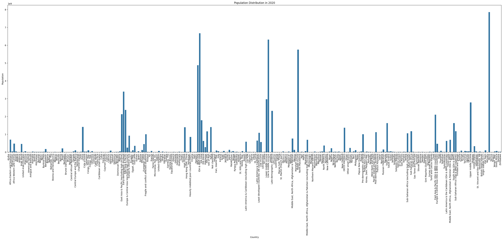
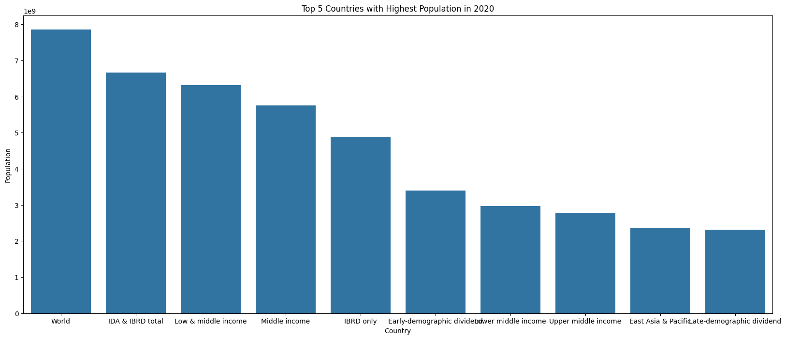
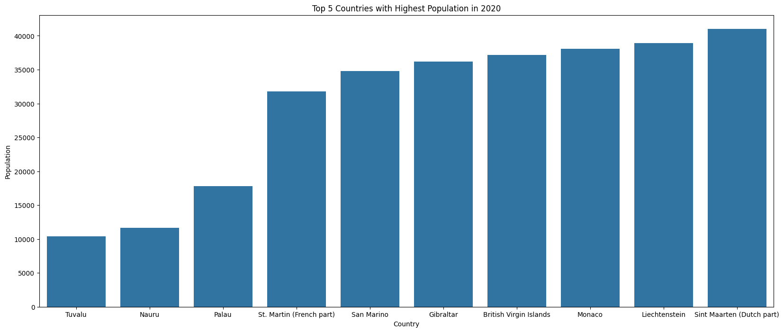

# 🌍 Population Analysis 2020

This project provides visual insights into the population distribution across countries for the year 2020 using Python 🐍, pandas 🐼, seaborn 🎨, and matplotlib 📊.
Understanding population distribution is crucial for planning, resource allocation, and policy-making. This visualization helps identify population-heavy countries as well as sparsely populated nations, giving a global perspective on demographic trends.

## 📁 Files

### 🐍 `population_analysis_2020.py`

This script generates:

📈 Histogram of population distribution

🗺️ Bar plot for all countries

🔝 Bar plot of Top 10 most populated countries

🔽 Bar plot of Bottom 10 least populated countries

# 🧰 Libraries Used
python

pandas

seaborn

matplotlib

# 📷 Sample Visualizations

## 🧠 Insights You Can Gain
Identify the most and least populated countries in 2020.

Compare population sizes across all countries visually.

Understand how populations are distributed globally.

# ✅ How to Run
Clone this repo or download the .ipynb file.

Open with Jupyter Notebook or VS Code (with Jupyter extension).

Ensure your CSV file path is correct:
df = pd.read_csv('API_SP.POP.TOTL_DS2_en_csv_v2_38144.csv')
